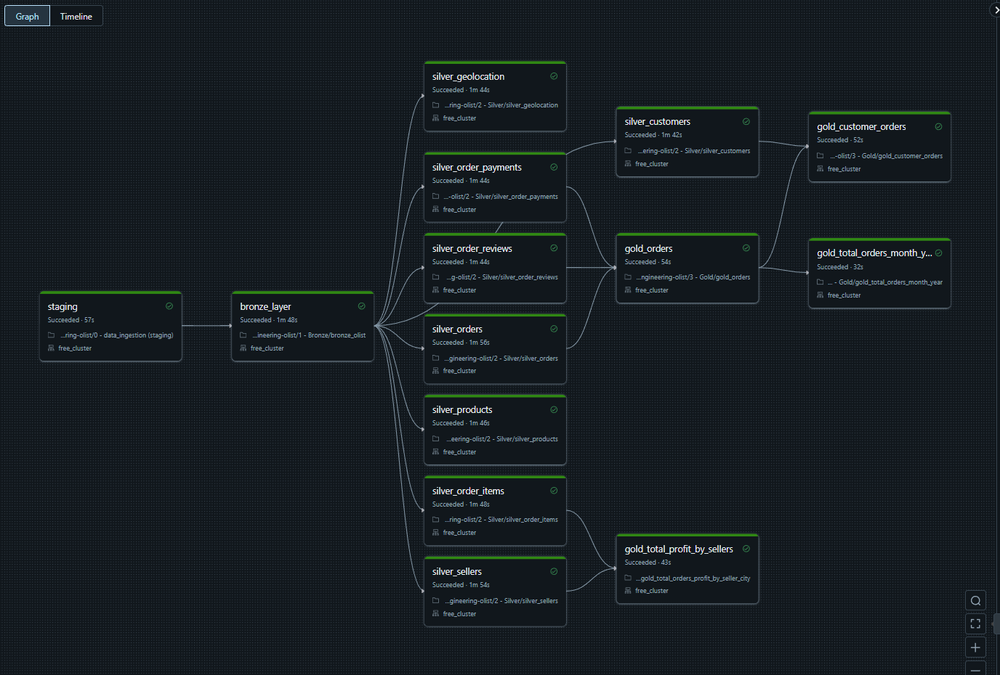
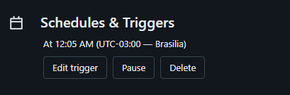
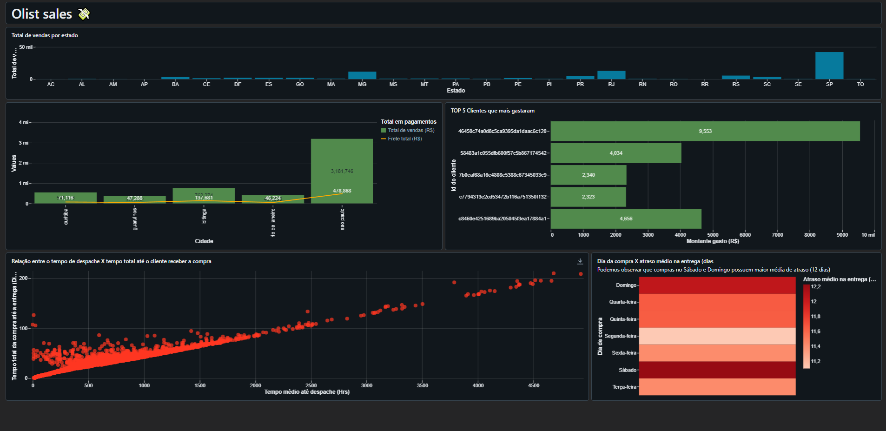

# 🗃️ Brazilian ecommerce olist

Após ingerirmos os dados do Kaggle, iremos fazer transformações e responder algumas perguntas de negócio, como:
- 1: Quantas vendas ocorrem por estado?
- 2: Qual loja/cidade captou o maior valor em vendas?
  - 2.1: Quanto desse valor veio por valor do produto?
  - 2.2: Quando desse valor foi por frete?
- 3: Qual a relação entre o dia de compra e o atraso na entrega?
- 4: Qual a relação entre o tempo da compra até o envio com o tempo total até a entrega?
- 5: Quais são os maiores compradores? (recência, frequência e valor gasto)

Essas e outras tantas perguntas podem ser respondidas com os dados que trataremos.

Juntem-se a mim, enquanto fazemos um overview do projeto.

Este é um conjunto de dados públicos de comércio eletrônico brasileiro das compras feitas na loja Olist. O conjunto de dados contém informações de 100 mil pedidos de 2016 a 2018 feitos em vários marketplaces no Brasil. Suas características permitem visualizar um pedido em várias dimensões: desde o status do pedido, preço, pagamento e desempenho de frete até a localização do cliente, atributos do produto e, finalmente, avaliações escritas pelos clientes. Também disponibilizamos um conjunto de dados de geolocalização que relaciona os códigos postais brasileiros às coordenadas lat/long.

Estes são dados comerciais reais, foram anonimizados, e as referências às empresas e parceiros no texto de revisão foram substituídas pelos nomes das grandes casas de Game of Thrones.

## 0 - beginning

Antes de tudo, executamos um script para criação dos databases (bronze, silver e gold)

## 1 - Ingestão de dados (staging)
O arquivo .ipynb responsável pela ingestão pode ser visto [aqui](https://github.com/gustavocrod/databricks-data-engineering-olist/blob/main/0%20-%20data_ingestion%20(staging).ipynb)

O dataset escolhido foi o [Brazilian E-Commerce Public Dataset by Olist](https://www.kaggle.com/datasets/olistbr/brazilian-ecommerces)
Utilizamos do opendatasets para fazer download diretamente do kaggle, ao adicionar as credenciais em um arquivo chamado kaggle.json na raiz do projeto (arquivo ignorado pelo .gitignore).

Como é um dataset estático (ou quase 100%), não faz sentido adicionar upsert e tampouco streaming.

Mas aqui poderíamos utilizar do AutoLoader, ou até mesmo de alguma ferramenta com CDC, como Airbyte.

Nossa staging não precisaria existir (apenas caso fossem dados vindos por airbyte, por exemplo). Mas criamos para exemplificar, pois irei salvar a staging em parquet. Depois disso, todas as camadas serão em Delta.

# Delta Lake House
Workflow

Agendamento

____
## [🥉 Bronze](https://github.com/gustavocrod/databricks-data-engineering/tree/main/project_ecommerce_olist/1%20-%20Bronze)

**Camada inicial, dados _as is_**

Muito importante que dados nessa camada reflitam o banco ou fonte dos dados

aqui podemos ter duplicidade em versões de dados que devem ser tratados nas camadas posteriores.
Costumo chamar essa camada de "lake"

### 1 - Processamento da camada bronze

Aqui adicionamos uma estrutura que permite um laço de repetição.
O laço será responsável por armazenar os dados e criar tabela delta referente a cada "entidade" definida no diagrama ER

### 2 - Persistência

Estamos pegando os arquivos em parquet (passo apenas didático), salvando os dados em delta e criando as tabelas delta

____

## [🥈 Silver]((https://github.com/gustavocrod/databricks-data-engineering/tree/main/project_ecommerce_olist/2%20-%20Silver))

**camada de limpeza, normalização e enriquecimento de dados.**

e.g., 
 - uppercase
 - data textual para tipo date
 - dias em atraso (diferença entre data atual e data de envimento)

p.s. embora tenha visto várias implementações distintas em projetos que atuei, prefiro desconsiderar as regras de negócio nessa camada (deixamos para aplicar na camada gold)
Na camada silver, limpezas e ajustes em dados devem ser aplicados
Caso seja possível, enriquecer os dados e extrair dados também deve acontecer nessa camada (definição adotada)

----
## [🥇 Gold]((https://github.com/gustavocrod/databricks-data-engineering-olist/tree/main/3%20-%20Gold))

**camada para aplicação de regras de negócio**

e.g.,
 - junção/união de tabelas
 - filtro de dados

 Nessa camada aplicamos dois tipos de agregações:
  * **1 - agregação _estilo_ dimensão e fato.** _i.e._, adicionamos joins entre as tabelas, conforme o schema disponibilizado.
  Dessa forma, como a tabela contém vários dados, multiplas agregações são podem ser feitas ao conectar essa tabela diretamente em ferramentes de visualização como o Power BI e Metabase, ou até mesmo via databricks Dashboards. Sendo ela como uma espécie de data mart
  * **2 - agregação analítica**. _i.e._, sumarização de dados.
  Dessa forma podemos adicionar em ferramentas mais simples ou também é util para algum analista que não detém conhecimento em SQL.

___

### 📜 Caso de estudo RFV

  Para responder as questões levantadas, tivemos um trabalho extra para explicitar a questão **5 Quais são os maiores compradores?**. Aqui avançamos para montar a base par análise de padrão de compras por clientes: **RFV**

RFV, ou Recency, Frequency, and Value, é uma técnica de análise de dados frequentemente usada em marketing e gerenciamento de clientes para segmentar clientes com base em seu comportamento de compra.

Essa abordagem analisa três aspectos principais do comportamento do cliente:

- **Recency (Recência):** Refere-se à última vez que um cliente fez uma compra. Geralmente, clientes que fizeram compras recentes são mais propensos a fazer compras futuras do que aqueles que não compraram há muito tempo.
- **Frequency (Frequência):** Refere-se à frequência com que um cliente faz compras durante um determinado período de tempo. Clientes que compram com frequência podem ser considerados mais leais e valiosos para a empresa.
- **Value (Valor):** Refere-se ao valor monetário total das compras feitas por um cliente durante um determinado período de tempo. Clientes que gastam mais têm um valor de vida do cliente mais alto e podem ser alvos de estratégias de marketing mais agressivas.

Ao analisar esses três aspectos juntos, as empresas podem segmentar seus clientes em diferentes grupos com base em seu comportamento de compra e adaptar suas estratégias de marketing e relacionamento com o cliente de acordo. Por exemplo, clientes com alta recência, frequência e valor podem ser segmentados como clientes VIP e receber ofertas exclusivas, enquanto clientes com baixa recência, frequência e valor podem ser alvos de campanhas de reativação.

## Dashboard

Ao analisar o dashboard, podemos ver que em SP é onde tem o maior numero de compradores (faz sentido pela população).
Podemos ver também as TOP5 cidades que mais venderam e os TOP5 clientes de mais compraram

Podemos observar também a relação entre o tempo de despache e o tempo total da compra até recebimento da mercadoria. Embora tenha ligação linear, podemos observar que vários casos tem atraso mesmo quando o despache é agil.

Por fim, observamos que compras feitas no final de semana possuem maior média de dias em atraso para a entrega.
