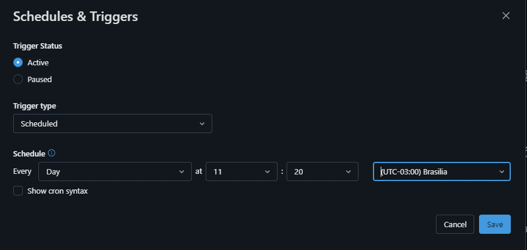
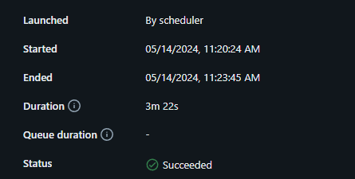

# 🛒 Kaggle Supermarket sales

Após ingerirmos os dados do Kaggle, iremos fazer transformações e responder algumas perguntas de negócio, como:
- 1 - Como foram as vendas por mês?
- 2 - Qual a distribuição de vendas por gênero?
- 3 - Qual a distribuição de vendas por tipo de pagamento?
- 4 - Total de vendas por tipo de produto?

Essas e outras (poucas) perguntas podem ser respondidas com os dados que trataremos.

Juntem-se a mim, enquanto fazemos um overview do projeto.

[Supermarket sales](https://www.kaggle.com/datasets/aungpyaeap/supermarket-sales)

O conjunto de dados é um registros histórico de vendas de uma empresa de supermercados (ficticio), que foi registrado em 3 filiais diferentes ao longo de 3 meses. 

### schema
 - ``Invoice`` ID: Número de identificação da fatura de venda gerado pelo computador
 - ``Branch``: Filial do supermercado (3 filiais disponíveis identificadas por A, B e C).
 - ``City``: Localização dos supermercados
 - ``Customer`` type: Tipo de clientes, registrados como _Member_ para clientes que usam cartão de membro e Normal para aqueles sem cartão de membro.
 - ``Gender``: Tipo de gênero do cliente
 - ``Product`` line: Grupos de categorização geral de itens - Acessórios eletrônicos, Acessórios de moda, Alimentos e bebidas, Saúde e beleza, Casa e estilo de vida, Esportes e viagens
 - ``Unit price``: Preço de cada produto em USD ($)
 - ``Quantity``: Número de produtos comprados pelo cliente
 - ``Tax 5%``: Taxa de imposto de 5% para clientes que compraram
 - ``Total``: Preço total incluindo impostos
 - ``Date``: Data da compra (Registro disponível de janeiro de 2019 a março de 2019)
 - ``Time``: timestamp bugado, Hora da compra (das 10h às 21h)
 - ``Payment``: Método de pagamento usado pelo cliente na compra (3 métodos estão disponíveis - Dinheiro, Cartão de crédito e Ewallet)
 - ``cogs``: Custo dos bens vendidos
 - ``gross margin percentage``: Porcentagem de margem bruta
## 0 - beginning

Antes de tudo, executamos um script para criação dos databases (bronze, silver e gold)

## 1 - Ingestão de dados (staging)
O arquivo .ipynb responsável pela ingestão pode ser visto [aqui](https://github.com/gustavocrod/databricks-data-engineering/blob/main/project_supermarket_sales/0%20-%20data_ingestion%20(staging).ipynb)

O dataset da vez foi o [Supermarket sales](https://www.kaggle.com/datasets/aungpyaeap/supermarket-sales)
Utilizamos do opendatasets para fazer download diretamente do kaggle, ao adicionar as credenciais em um arquivo chamado kaggle.json na raiz do projeto (arquivo ignorado pelo .gitignore).

Como é um dataset estático (ou quase 100%), não faz sentido adicionar upsert e tampouco streaming.

Mas aqui poderíamos utilizar do AutoLoader, ou até mesmo de alguma ferramenta com CDC, como Airbyte.

Nossa staging não precisaria existir (apenas caso fossem dados vindos por airbyte, por exemplo). Mas criamos para exemplificar, pois irei salvar a staging em parquet. Depois disso, todas as camadas serão em Delta.

# Delta Lake House
Workflow

Agendamento

____
## [🥉 Bronze](https://github.com/gustavocrod/databricks-data-engineering/blob/main/project_supermarket_sales/1%20-%20bronze)

**Camada inicial, dados _as is_**

Muito importante que dados nessa camada reflitam o banco ou fonte dos dados

aqui podemos ter duplicidade em versões de dados que devem ser tratados nas camadas posteriores.
Costumo chamar essa camada de "lake"

### 1 - Processamento da camada bronze
Na camada bronze, nenhuma limpeza ou regra de negócio devem ser aplicadas aos dados.

Porém aqui temos dados que demandam de um pequeno tratamento: nome dos campos.

Para armazenarmos em formato delta, precisaremos tratar o nome dos campos. (outros tratamentos devem acontecer na camada subsequente)

Para essa limpeza dos dados, utilizamos do método ``fix_df_column_names`` definido em [``_utils``](https://github.com/gustavocrod/databricks-data-engineering/blob/main/_utils.py)

### 2 - Persistência

Estamos pegando os arquivos em parquet (passo apenas didático), salvando os dados em delta e criando a delta table

____

## [🥈 Silver](https://github.com/gustavocrod/databricks-data-engineering/tree/main/project_supermarket_sales/3%20-%20gold)

**camada de limpeza, normalização e enriquecimento de dados.**

e.g., 
 - uppercase
 - data textual para tipo date
 - dias em atraso (diferença entre data atual e data de envimento)

p.s. embora tenha visto várias implementações distintas em projetos que atuei, prefiro desconsiderar as regras de negócio nessa camada (deixamos para aplicar na camada gold)
Na camada silver, limpezas e ajustes em dados devem ser aplicados
Caso seja possível, enriquecer os dados e extrair dados também deve acontecer nessa camada (definição adotada)

Nesse conjunto extremamente enxuto, temos apenas 1 tabela para tratamento. 

----
## [🥇 Gold]((https://github.com/gustavocrod/databricks-data-engineering-olist/tree/main/3%20-%20Gold))

**camada para aplicação de regras de negócio**

e.g.,
 - junção/união de tabelas
 - filtro de dados

 Nessa camada aplicamos dois tipos de agregações:
  * **1 - agregação _estilo_ dimensão e fato.** _i.e._, adicionamos joins entre as tabelas, conforme o schema disponibilizado.
  Dessa forma, como a tabela contém vários dados, multiplas agregações são podem ser feitas ao conectar essa tabela diretamente em ferramentes de visualização como o Power BI e Metabase, ou até mesmo via databricks Dashboards. Sendo ela como uma espécie de data mart
  * **2 - agregação analítica**. _i.e._, sumarização de dados.
  Dessa forma podemos adicionar em ferramentas mais simples ou também é util para algum analista que não detém conhecimento em SQL.

## Dashboard

Nesse dashboard visualizamos a distribuição de vendas por tipo de pagamento, e podemos entender que pagamento via Dinheiro em espécia "cash", é a forma mais utilizada.
Podemos também entender que não há diferença sinificante entre compas entre homens e mulheres. O setor que mais vende é o de acessórios fashion. E o mês 1 foi o que mais teve vendas

 - ``gross income``: Renda bruta
 - ``Rating``: Classificação de estratificação do cliente em sua experiência de compra geral (Em uma escala de 1 a 10)